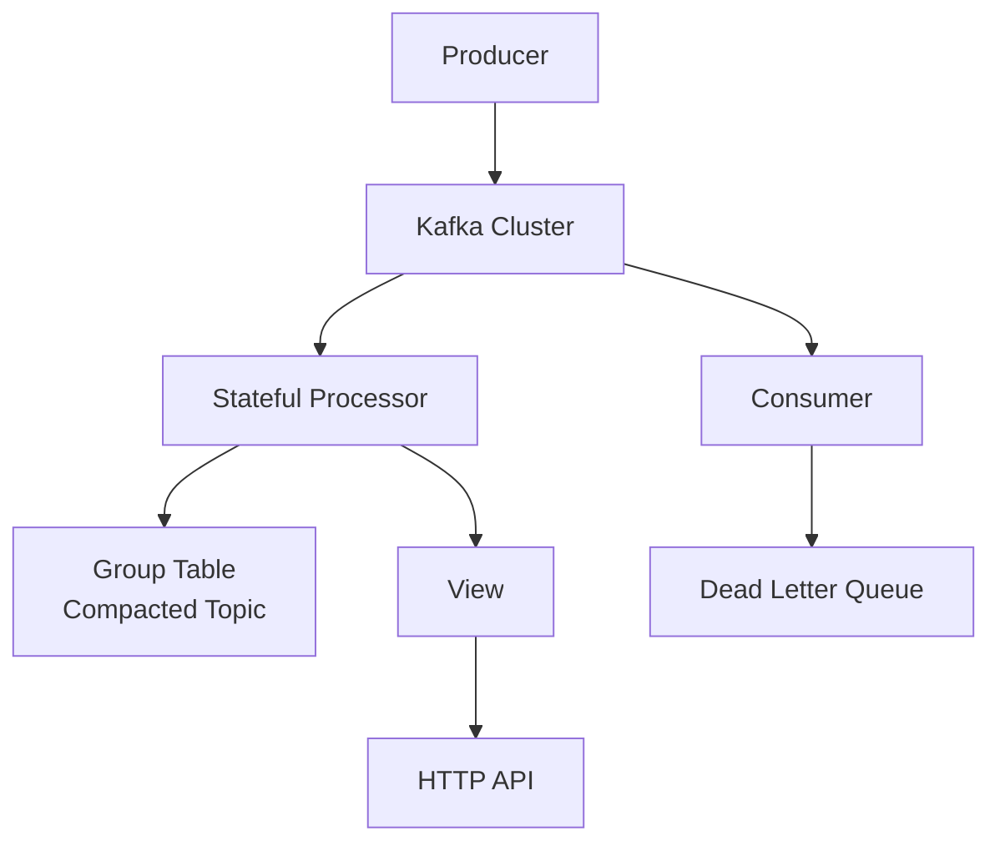
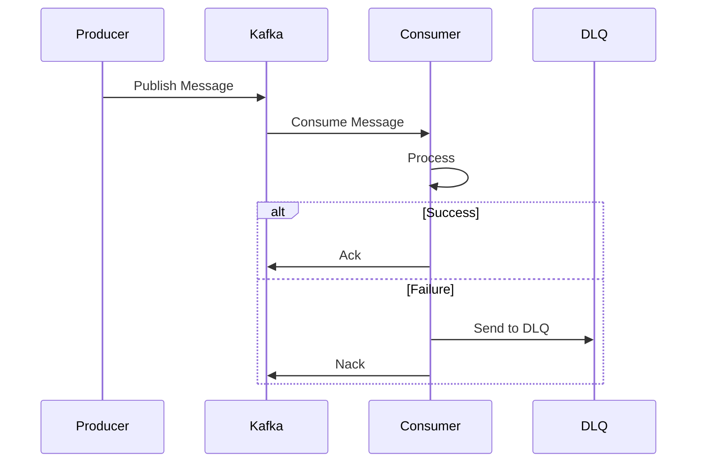

# Quick Wins - Immediate Improvements

These are high-impact, low-effort improvements that can be implemented quickly (1-2 days each).

## 🎯 Top 5 Quick Wins

### 1. Health Check Endpoints (2-3 hours)

**Why**: Essential for Kubernetes and production deployments

```go
// pkg/kafka/health.go
package kafka

import (
    "context"
    "time"
)

type Health struct {
    Status    string    `json:"status"`
    Timestamp time.Time `json:"timestamp"`
    Checks    []Check   `json:"checks"`
}

type Check struct {
    Name   string `json:"name"`
    Status string `json:"status"`
    Error  string `json:"error,omitempty"`
}

func (c *Client) HealthCheck(ctx context.Context) *Health {
    health := &Health{
        Status:    "healthy",
        Timestamp: time.Now(),
        Checks:    []Check{},
    }

    // Check publisher
    if err := c.checkPublisher(); err != nil {
        health.Checks = append(health.Checks, Check{
            Name:   "publisher",
            Status: "unhealthy",
            Error:  err.Error(),
        })
        health.Status = "unhealthy"
    } else {
        health.Checks = append(health.Checks, Check{
            Name:   "publisher",
            Status: "healthy",
        })
    }

    // Check subscriber
    if err := c.checkSubscriber(); err != nil {
        health.Checks = append(health.Checks, Check{
            Name:   "subscriber",
            Status: "unhealthy",
            Error:  err.Error(),
        })
        health.Status = "unhealthy"
    } else {
        health.Checks = append(health.Checks, Check{
            Name:   "subscriber",
            Status: "healthy",
        })
    }

    return health
}

// HTTP Handler
func HealthHandler(client *Client) http.HandlerFunc {
    return func(w http.ResponseWriter, r *http.Request) {
        health := client.HealthCheck(r.Context())

        w.Header().Set("Content-Type", "application/json")
        if health.Status != "healthy" {
            w.WriteHeader(http.StatusServiceUnavailable)
        }

        json.NewEncoder(w).Encode(health)
    }
}
```

### 2. Structured Logging (3-4 hours)

**Why**: Better debugging and log aggregation

```go
// pkg/kafka/logger.go
package kafka

import (
    "log/slog"
    "os"
)

type StructuredLogger struct {
    logger *slog.Logger
}

func NewStructuredLogger() *StructuredLogger {
    handler := slog.NewJSONHandler(os.Stdout, &slog.HandlerOptions{
        Level: slog.LevelInfo,
    })
    return &StructuredLogger{
        logger: slog.New(handler),
    }
}

func (l *StructuredLogger) Info(msg string, fields map[string]interface{}) {
    attrs := make([]slog.Attr, 0, len(fields))
    for k, v := range fields {
        attrs = append(attrs, slog.Any(k, v))
    }
    l.logger.LogAttrs(nil, slog.LevelInfo, msg, attrs...)
}

// Usage
logger := kafka.NewStructuredLogger()
logger.Info("Message published", map[string]interface{}{
    "topic":       "orders",
    "message_id":  msg.UUID,
    "partition":   3,
    "offset":      12345,
    "latency_ms":  23,
})

// Output:
// {"time":"2024-01-15T10:30:00Z","level":"INFO","msg":"Message published","topic":"orders","message_id":"abc-123","partition":3,"offset":12345,"latency_ms":23}
```

### 3. Configuration Validation (2 hours)

**Why**: Catch errors early, better DX

```go
// pkg/kafka/validation.go
package kafka

import "fmt"

func (c *Config) ValidateExtended() error {
    if err := c.Validate(); err != nil {
        return err
    }

    // Check for common misconfigurations
    warnings := []string{}

    // Heartbeat should be 1/3 of session timeout
    recommendedHeartbeat := c.Consumer.SessionTimeout / 3
    if c.Consumer.HeartbeatInterval > recommendedHeartbeat {
        warnings = append(warnings, fmt.Sprintf(
            "HeartbeatInterval (%v) should be < SessionTimeout/3 (%v)",
            c.Consumer.HeartbeatInterval,
            recommendedHeartbeat,
        ))
    }

    // Batch size should be reasonable
    if c.Consumer.FetchMax < c.Consumer.FetchDefault {
        warnings = append(warnings, "FetchMax < FetchDefault")
    }

    // Production settings check
    if c.Producer.RequiredAcks != sarama.WaitForAll {
        warnings = append(warnings, "RequiredAcks != WaitForAll - data loss possible")
    }

    if len(warnings) > 0 {
        return &ConfigWarning{Warnings: warnings}
    }

    return nil
}

type ConfigWarning struct {
    Warnings []string
}

func (e *ConfigWarning) Error() string {
    return fmt.Sprintf("Configuration warnings: %v", e.Warnings)
}
```

### 4. Graceful Shutdown (3 hours)

**Why**: Prevent message loss on shutdown

```go
// pkg/kafka/shutdown.go
package kafka

import (
    "context"
    "os"
    "os/signal"
    "syscall"
    "time"
)

type GracefulShutdown struct {
    client          *Client
    shutdownTimeout time.Duration
    callbacks       []func() error
}

func NewGracefulShutdown(client *Client, timeout time.Duration) *GracefulShutdown {
    return &GracefulShutdown{
        client:          client,
        shutdownTimeout: timeout,
        callbacks:       []func() error{},
    }
}

func (g *GracefulShutdown) OnShutdown(callback func() error) {
    g.callbacks = append(g.callbacks, callback)
}

func (g *GracefulShutdown) Wait() {
    sigChan := make(chan os.Signal, 1)
    signal.Notify(sigChan, os.Interrupt, syscall.SIGTERM)
    <-sigChan

    log.Println("Shutdown signal received, gracefully shutting down...")

    ctx, cancel := context.WithTimeout(context.Background(), g.shutdownTimeout)
    defer cancel()

    // Stop accepting new messages
    if err := g.client.Stop(); err != nil {
        log.Printf("Error stopping client: %v", err)
    }

    // Run shutdown callbacks
    for _, callback := range g.callbacks {
        if err := callback(); err != nil {
            log.Printf("Shutdown callback error: %v", err)
        }
    }

    // Wait for in-flight messages
    <-ctx.Done()

    log.Println("Shutdown complete")
}

// Usage
shutdown := kafka.NewGracefulShutdown(client, 30*time.Second)
shutdown.OnShutdown(func() error {
    // Flush metrics
    return metrics.Flush()
})
shutdown.OnShutdown(func() error {
    // Save state
    return processor.SaveState()
})
shutdown.Wait()
```

### 5. Message Metadata Helpers (1-2 hours)

**Why**: Common operations, better DX

```go
// pkg/kafka/metadata.go
package kafka

import (
    "encoding/json"
    "time"
    "github.com/ThreeDotsLabs/watermill/message"
)

type MessageHelper struct{}

func NewMessageHelper() *MessageHelper {
    return &MessageHelper{}
}

// Correlation ID support
func (h *MessageHelper) SetCorrelationID(msg *message.Message, correlationID string) {
    msg.Metadata.Set("correlation_id", correlationID)
}

func (h *MessageHelper) GetCorrelationID(msg *message.Message) string {
    return msg.Metadata.Get("correlation_id")
}

// Trace context
func (h *MessageHelper) SetTraceContext(msg *message.Message, traceID, spanID string) {
    msg.Metadata.Set("trace_id", traceID)
    msg.Metadata.Set("span_id", spanID)
}

// Timestamps
func (h *MessageHelper) SetCreatedAt(msg *message.Message, t time.Time) {
    msg.Metadata.Set("created_at", t.Format(time.RFC3339Nano))
}

func (h *MessageHelper) GetCreatedAt(msg *message.Message) (time.Time, error) {
    ts := msg.Metadata.Get("created_at")
    if ts == "" {
        return time.Time{}, fmt.Errorf("created_at not set")
    }
    return time.Parse(time.RFC3339Nano, ts)
}

// Content type
func (h *MessageHelper) SetContentType(msg *message.Message, contentType string) {
    msg.Metadata.Set("content_type", contentType)
}

// Message age
func (h *MessageHelper) GetAge(msg *message.Message) (time.Duration, error) {
    createdAt, err := h.GetCreatedAt(msg)
    if err != nil {
        return 0, err
    }
    return time.Since(createdAt), nil
}

// Headers as JSON
func (h *MessageHelper) SetHeaders(msg *message.Message, headers map[string]string) error {
    data, err := json.Marshal(headers)
    if err != nil {
        return err
    }
    msg.Metadata.Set("headers", string(data))
    return nil
}

func (h *MessageHelper) GetHeaders(msg *message.Message) (map[string]string, error) {
    headersStr := msg.Metadata.Get("headers")
    if headersStr == "" {
        return nil, nil
    }

    var headers map[string]string
    err := json.Unmarshal([]byte(headersStr), &headers)
    return headers, err
}

// Usage
helper := kafka.NewMessageHelper()
helper.SetCorrelationID(msg, "req-123")
helper.SetCreatedAt(msg, time.Now())
helper.SetHeaders(msg, map[string]string{
    "source": "api-gateway",
    "user_id": "user-456",
})

age, _ := helper.GetAge(msg)
log.Printf("Message age: %v", age)
```

## 🔧 Infrastructure Quick Wins

### 6. Docker Compose for Development (1 hour)

Add more services to docker-compose.yml:

```yaml
version: '3.8'

services:
  zookeeper:
    # ... existing ...

  kafka:
    # ... existing ...

  kafka-ui:
    # ... existing ...

  # NEW: Schema Registry
  schema-registry:
    image: confluentinc/cp-schema-registry:7.5.0
    depends_on:
      - kafka
    ports:
      - "8081:8081"
    environment:
      SCHEMA_REGISTRY_HOST_NAME: schema-registry
      SCHEMA_REGISTRY_KAFKASTORE_BOOTSTRAP_SERVERS: kafka:29092

  # NEW: Kafka Connect
  kafka-connect:
    image: confluentinc/cp-kafka-connect:7.5.0
    depends_on:
      - kafka
      - schema-registry
    ports:
      - "8083:8083"
    environment:
      CONNECT_BOOTSTRAP_SERVERS: kafka:29092
      CONNECT_REST_PORT: 8083
      CONNECT_GROUP_ID: "connect-cluster"
      CONNECT_CONFIG_STORAGE_TOPIC: "connect-configs"
      CONNECT_OFFSET_STORAGE_TOPIC: "connect-offsets"
      CONNECT_STATUS_STORAGE_TOPIC: "connect-status"

  # NEW: Prometheus
  prometheus:
    image: prom/prometheus:latest
    ports:
      - "9090:9090"
    volumes:
      - ./prometheus.yml:/etc/prometheus/prometheus.yml
    command:
      - '--config.file=/etc/prometheus/prometheus.yml'

  # NEW: Grafana
  grafana:
    image: grafana/grafana:latest
    ports:
      - "3000:3000"
    environment:
      - GF_SECURITY_ADMIN_PASSWORD=admin
    volumes:
      - ./grafana/dashboards:/etc/grafana/provisioning/dashboards
      - ./grafana/datasources:/etc/grafana/provisioning/datasources
```

### 7. GitHub Actions CI/CD (2 hours)

```.github/workflows/ci.yml
name: CI

on:
  push:
    branches: [ main ]
  pull_request:
    branches: [ main ]

jobs:
  test:
    runs-on: ubuntu-latest

    services:
      kafka:
        image: confluentinc/cp-kafka:7.5.0
        ports:
          - 9092:9092
        env:
          KAFKA_BROKER_ID: 1
          KAFKA_ZOOKEEPER_CONNECT: 'zookeeper:2181'
          KAFKA_LISTENERS: PLAINTEXT://localhost:9092

    steps:
    - uses: actions/checkout@v3

    - name: Set up Go
      uses: actions/setup-go@v4
      with:
        go-version: '1.21'

    - name: Download dependencies
      run: go mod download

    - name: Run tests
      run: go test -v -race -coverprofile=coverage.out ./...

    - name: Upload coverage
      uses: codecov/codecov-action@v3
      with:
        files: ./coverage.out

    - name: Run linter
      uses: golangci/golangci-lint-action@v3
      with:
        version: latest

    - name: Build examples
      run: make build
```

### 8. Makefile Enhancements (30 minutes)

Add useful targets:

```makefile
.PHONY: docker-build docker-push test-integration benchmark profile

docker-build: ## Build Docker image
	docker build -t watermill-kafka:latest .

docker-push: ## Push Docker image
	docker push watermill-kafka:latest

test-integration: ## Run integration tests
	docker-compose -f docker-compose.test.yml up -d
	go test -tags=integration -v ./tests/integration/...
	docker-compose -f docker-compose.test.yml down

benchmark: ## Run benchmarks
	go test -bench=. -benchmem ./...

profile: ## Run CPU profiling
	go test -cpuprofile=cpu.prof -memprofile=mem.prof -bench=.
	go tool pprof cpu.prof

coverage-html: ## Generate HTML coverage report
	go test -coverprofile=coverage.out ./...
	go tool cover -html=coverage.out -o coverage.html
	open coverage.html

security-scan: ## Run security scan
	gosec ./...

deps-update: ## Update dependencies
	go get -u ./...
	go mod tidy

generate: ## Run go generate
	go generate ./...
```

## 📚 Documentation Quick Wins

### 9. Architecture Diagrams (2-3 hours)

Create visual documentation:

```markdown
# ARCHITECTURE.md

## System Architecture



## Data Flow


```

### 10. FAQ Document (1 hour)

```markdown
# FAQ.md

## Frequently Asked Questions

### Q: How do I achieve exactly-once processing?
A: Use manual offset commits + idempotent producer:
```go
config.Consumer.AutoCommit = false
config.Producer.Idempotent = true
```

### Q: What's the difference between simple and advanced batch consumer?
A: Advanced batch consumer adds:
- 4 error handling strategies
- Metrics collection
- Byte-aware batching
- Partitioned batching

### Q: How do I monitor consumer lag?
A: Check the metrics endpoint or use the health check

### Q: When should I use stateful processors vs regular consumers?
A: Use stateful processors when you need:
- Aggregations per key
- State persistence
- Join operations
- Read-only views of state
```

## 📊 Impact vs Effort Matrix

| Quick Win | Impact | Effort | Time |
|-----------|--------|--------|------|
| Health Checks | 🔴 High | 🟢 Low | 3h |
| Structured Logging | 🔴 High | 🟢 Low | 4h |
| Config Validation | 🟡 Medium | 🟢 Low | 2h |
| Graceful Shutdown | 🔴 High | 🟢 Low | 3h |
| Message Helpers | 🟡 Medium | 🟢 Low | 2h |
| Docker Compose | 🟡 Medium | 🟢 Low | 1h |
| GitHub Actions | 🔴 High | 🟢 Low | 2h |
| Makefile Enhancements | 🟢 Low | 🟢 Low | 30m |
| Architecture Diagrams | 🟡 Medium | 🟢 Low | 3h |
| FAQ Document | 🟡 Medium | 🟢 Low | 1h |

**Total Time: ~20 hours** (can be done in a week)

## 🎯 Implementation Order

1. **Day 1** (6h): Health Checks + Graceful Shutdown + GitHub Actions
2. **Day 2** (5h): Structured Logging + Config Validation + Message Helpers
3. **Day 3** (4h): Docker Compose + Makefile + Documentation
4. **Days 4-5**: Testing and refinement

All these improvements are production-ready and will significantly enhance the library!
